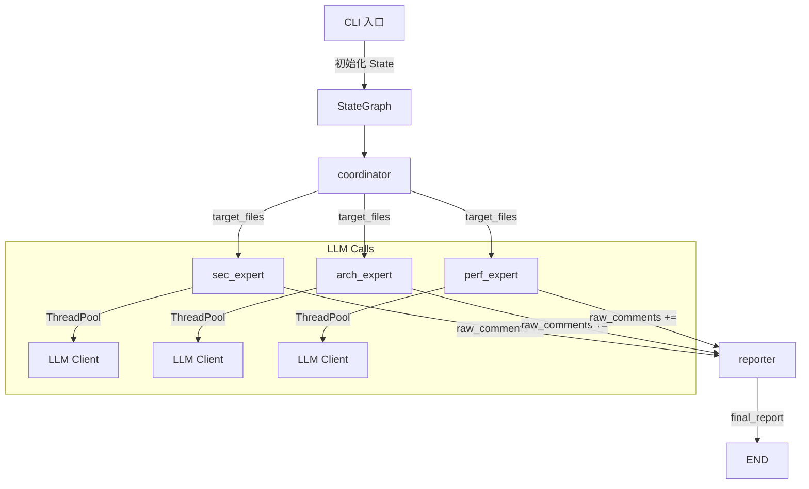
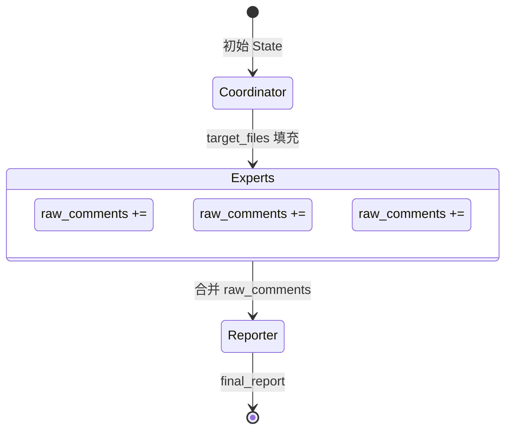

# Architecture

## 系统架构



## Agent 架构

**无 Agent 协作**。每个专家节点独立运行，不与其他节点通信。节点之间通过 State 的 `raw_comments` 字段（`Annotated[List, operator.add]`）累加结果。

架构模式：**Fan-out / Fan-in**

1. coordinator 扫描文件，写入 `target_files`
2. 3 个专家并发读取 `target_files`，各自调用 LLM 审查
3. 每个专家将问题 append 到 `raw_comments`
4. reporter 读取全部 `raw_comments`，去重 + 格式化

## Graph 架构

- 类型：`StateGraph(SharedReviewState)`
- 入口：`coordinator`
- 终止：`reporter → END`
- 无条件路由，无循环

## State 流转



**State 字段**:

| 字段 | 类型 | 写入者 | 说明 |
|------|------|--------|------|
| mode | str | CLI → coordinator | all/diff/path |
| target_files | List[dict] | coordinator | 待审查文件列表 |
| raw_comments | List[AgentIssue] | 3 个专家 | 累加（operator.add） |
| final_report | str | reporter | 最终报告文本 |
| diff_branch | str | CLI | diff 模式基准分支 |
| target_path | str | CLI | path 模式目标路径 |
| output_format | str | CLI | markdown / json |

## Tool 调用

不使用 LangChain Tool / MCP。每个专家节点直接调用 `LLMClient.review_code()`：

```
node(state)
  → LLMClient()          # 初始化
  → load_prompt(role)     # 加载 prompt
  → _build_custom_rules_section(role)  # 加载自定义规则（可选）
  → ThreadPoolExecutor:   # 并发处理文件
      → client.review_code(file, content, role_prompt, base_prompt, diff_lines)
          → _prepare_code_content()  # diff 模式裁剪
          → chat_model.invoke()      # LLM 调用
          → _parse_response()        # JSON 解析 + Pydantic 验证
  → {"raw_comments": all_issues}
```

## Memory 机制

**无 Memory**。每次审查独立运行，无 checkpoint、无 conversation memory、无 vector store。

## Human-in-the-loop

**无**。全自动化流程，无人工审批节点。

## Router 逻辑

**无 Router**。Graph 是静态拓扑，coordinator 到 3 个专家是固定边，无条件判断。

## 核心模块职责

| 模块 | 职责 |
|------|------|
| `cli.py` | 参数解析、State 初始化、Graph 调用、输出 |
| `config.py` | YAML + env 配置加载，环境变量替换，自定义审查规则 |
| `agent/nodes/base_expert.py` | 共享专家逻辑，自定义规则注入 prompt |
| `llm_client.py` | LLM 调用封装，重试，JSON 解析修复，Pydantic 验证 |
| `agent/graph.py` | StateGraph 拓扑定义 |
| `agent/state.py` | State 和 Issue 类型定义 |
| `agent/nodes/coordinator.py` | 文件扫描（all/diff/path 三种模式） |
| `agent/nodes/*_expert.py` | 并发审查，每个专家 5 线程 |
| `agent/nodes/reporter.py` | 去重 + 格式化 |
| `formatter.py` | Markdown/JSON 报告格式化 |
| `git_utils.py` | Git diff 解析，变更行号提取 |
| `github_client.py` | PR 评论发布 |
