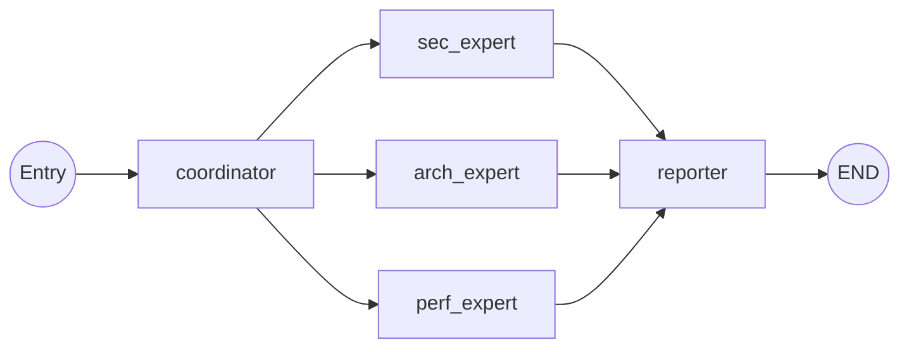
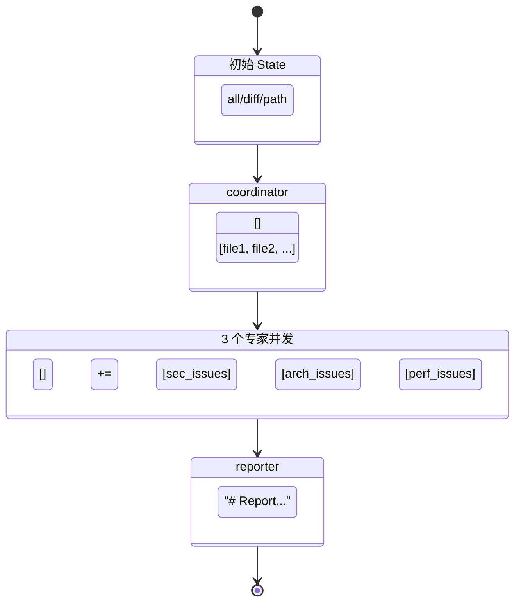

# Graph

## StateGraph 定义

文件：`agent/graph.py`

```python
workflow = StateGraph(SharedReviewState)
```

## Node 列表

| Node | 函数 | 文件 |
|------|------|------|
| coordinator | `coordinator_node` | `agent/nodes/coordinator.py` |
| sec_expert | `sec_expert_node` | `agent/nodes/sec_expert.py` |
| arch_expert | `arch_expert_node` | `agent/nodes/arch_expert.py` |
| perf_expert | `perf_expert_node` | `agent/nodes/perf_expert.py` |
| reporter | `reporter_node` | `agent/nodes/reporter.py` |

## Edge 拓扑

```
coordinator → sec_expert
coordinator → arch_expert
coordinator → perf_expert
sec_expert  → reporter
arch_expert → reporter
perf_expert → reporter
reporter    → END
```

## Graph 流程图



## 调用链

```
graph.invoke(initial_state)
  └─ coordinator_node(state)
       ├─ mode=all:  _scan_directory(".")
       ├─ mode=diff: get_diff_files(branch) → filter_code_files
       └─ mode=path: 单文件或目录扫描
       → 返回 {target_files: [...], raw_comments: []}

  ┌─ sec_expert_node(state)     ─┐
  ├─ arch_expert_node(state)     │ 并发执行
  └─ perf_expert_node(state)    ─┘
       每个节点内部：
       └─ ThreadPoolExecutor(max_workers=5)
            └─ _review_single_file(file)
                 └─ client.review_code(...)
                      └─ chat_model.invoke(messages)
       → 返回 {raw_comments: [AgentIssue, ...]}

  └─ reporter_node(state)
       ├─ deduplicate_issues(raw_comments)
       └─ formatter.format(issues)
       → 返回 {final_report: "..."}
```

## 状态流转图



## 关键特性

| 特性 | 状态 |
|------|------|
| Graph 入口 | `coordinator` |
| Graph 终止 | `reporter → END` |
| Conditional Edge | 无 |
| Router | 无 |
| Retry 机制 | LLM 调用层（tenacity），非 Graph 层 |
| Fallback 机制 | 无 |
| Checkpoint | 无 |
| 子图 | 无 |

## 并发模型

Graph 层：LangGraph 自动并发执行 coordinator 的 3 个下游节点。

节点内部：每个专家节点使用 `ThreadPoolExecutor(max_workers=5)` 并发审查文件。

最大并发 LLM 调用数：3（专家数） × 5（线程数）= **15**。
