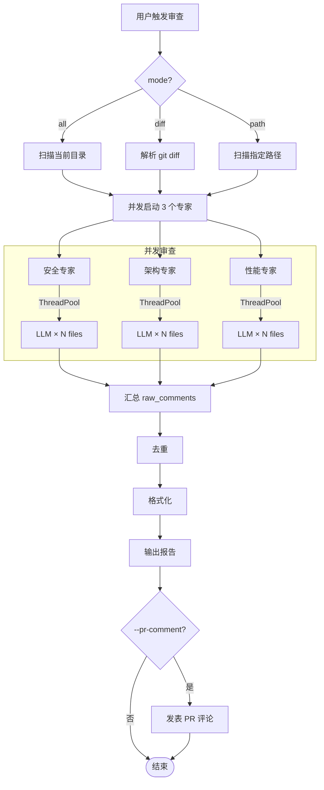

# Workflows

## 核心工作流：Fan-out / Fan-in

唯一工作流。无 planner-executor、multi-agent 协作、reflection、self-correction 等。



## 模式分支

### all 模式

1. `os.walk(".")` 遍历当前目录
2. 按 `SUPPORTED_EXTENSIONS` 过滤
3. 跳过 `SKIP_DIRS`
4. 读取每个文件内容

### diff 模式

1. 执行 `git diff {branch}` 获取 diff 输出
2. 正则解析变更文件、状态（added/modified/deleted）、变更行号
3. 按 `SUPPORTED_EXTENSIONS` 过滤
4. 读取非 deleted 文件内容
5. 保留 `diff_lines` 用于 LLM 聚焦

### path 模式

1. 判断路径是文件还是目录
2. 文件：直接读取（需扩展名匹配）
3. 目录：遍历扫描（同 all 模式）

## Workflow 切换条件

无动态切换。模式在 CLI 入口确定，整个 Graph 执行期间不变。

## Fallback

**无**。任何节点异常直接导致结果不完整：
- coordinator 异常 → `target_files` 为空 → 专家无文件可审
- 专家异常 → `raw_comments` 缺少该专家的问题
- reporter 异常 → 无报告输出

## Retry

仅 LLM 调用层有重试（`tenacity`），Graph 层无重试。

```
LLM 调用重试策略：
- 最大重试次数：3
- 退避策略：指数退避（2s, 4s, 8s, max 10s）
- 仅对网络/超时错误重试
- ValidationError 不重试（说明 LLM 输出格式错误）
```

## Human Approval

**无**。全自动化，无人工审批节点。
